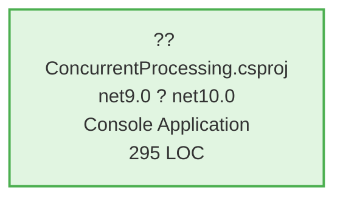

# .NET 10 Upgrade Plan

## Table of Contents

- [Executive Summary](#executive-summary)
- [Migration Strategy](#migration-strategy)
- [Detailed Dependency Analysis](#detailed-dependency-analysis)
- [Project-by-Project Plans](#project-by-project-plans)
  - [ConcurrentProcessing.csproj](#concurrentprocessingcsproj)
- [Breaking Changes Catalog](#breaking-changes-catalog)
- [Risk Management](#risk-management)
- [Testing & Validation Strategy](#testing--validation-strategy)
- [Complexity & Effort Assessment](#complexity--effort-assessment)
- [Source Control Strategy](#source-control-strategy)
- [Success Criteria](#success-criteria)

---

## Executive Summary

### Scenario Description

This plan guides the upgrade of the **ConcurrentProcessing** solution from **.NET 9.0** to **.NET 10.0 (Long Term Support)**. The solution consists of a single console application project targeting modern .NET, with minimal dependencies and a clean, maintainable codebase.

### Scope

**Projects to Upgrade:**
- 1 project total
- ConcurrentProcessing.csproj (Console Application)

**Current State:**
- Target Framework: net9.0
- Total Lines of Code: 295
- NuGet Packages: 1 (Microsoft.CodeAnalysis.NetAnalyzers v9.0.0)
- Code Files: 6
- Files with Issues: 2

**Target State:**
- Target Framework: net10.0
- All packages verified compatible with .NET 10
- All API compatibility issues resolved

### Selected Strategy

**All-At-Once Strategy** - Single atomic upgrade operation for the entire solution.

**Rationale:**
- **Single Project**: No dependency coordination needed between projects
- **Small Codebase**: 295 LOC makes comprehensive changes manageable
- **Low Complexity**: Assessment rates difficulty as ?? Low
- **High Package Compatibility**: 100% of packages already compatible
- **Minimal Breaking Changes**: Only 1 source-incompatible API requiring attention
- **No Security Issues**: Clean baseline for upgrade
- **SDK-Style Project**: Modern project format simplifies upgrade

### Complexity Assessment

**Solution Metrics:**
- Total Projects: 1
- Dependency Depth: 0 (no project dependencies)
- High-Risk Projects: 0
- Security Vulnerabilities: 0
- Total API Issues: 1 (source incompatible)
- Estimated Code Impact: 1+ LOC (0.3% of codebase)

**Complexity Classification: Simple**

This is a straightforward upgrade scenario with:
- Single standalone project
- No dependency management complexity
- Small, focused codebase
- Minimal breaking changes
- All packages already compatible
- Modern SDK-style project structure

### Critical Issues

**API Compatibility:**
- ?? **1 Source Incompatible API**: `System.TimeSpan.FromMilliseconds(Int64, Int64)` - new overload introduced in .NET 9+ may cause compilation ambiguity

**No Security Vulnerabilities Detected** ?

### Recommended Approach

**All-at-once atomic upgrade** is optimal for this scenario:
1. Update project file TargetFramework property
2. Optionally update analyzer package to v10.x for .NET 10 analyzer support
3. Build and resolve the single API compatibility issue
4. Validate functionality

### Iteration Strategy

**Fast Batch Approach** - Complete all planning details in 2-3 focused iterations:
- Foundation iteration establishes strategy and analysis
- Detail iteration provides comprehensive project-specific plans
- Final iteration covers validation and success criteria

**Estimated Iterations:** 5-6 total (3 foundation + 2-3 detail)

---

## Migration Strategy

### Approach Selection

**Selected Strategy: All-At-Once**

This solution follows the **All-At-Once Strategy**, upgrading all components simultaneously in a single atomic operation.

### Justification

**Why All-At-Once is Optimal:**
1. **Single Project Simplicity**
   - Only 1 project eliminates coordination complexity
   - No dependency ordering concerns
   - No multi-targeting requirements
   - Single point of validation

2. **Small Codebase**
   - 295 total lines of code
   - Changes estimated at 1+ LOC (0.3% impact)
   - Comprehensive testing feasible in single pass
   - Low risk of extensive refactoring

3. **High Package Compatibility**
   - 100% package compatibility (1 of 1 packages)
   - Microsoft.CodeAnalysis.NetAnalyzers already compatible
   - No breaking package changes to coordinate
   - Optional analyzer update has zero migration risk

4. **Minimal Breaking Changes**
   - Single API compatibility issue (source-level only)
   - No binary incompatibilities
   - No behavioral changes requiring testing
   - Clear, isolated fix location

5. **Modern Project Structure**
   - SDK-style project format
   - No legacy .NET Framework concerns
   - Already on .NET 9.0 (modern .NET baseline)
   - Clean upgrade path to .NET 10 LTS

**Alternative Rejected: Incremental Strategy**
- Unnecessary complexity for single-project solution
- No phasing benefits when no dependencies exist
- Would artificially extend timeline
- No risk reduction benefit

### All-At-Once Strategy Rationale

The All-At-Once strategy is specifically designed for scenarios like this:
- Small to medium solutions (? 1 project)
- All projects on .NET 6+ or netstandard2.0+ (? .NET 9.0)
- Homogeneous codebase (? single console app)
- Low external dependency complexity (? 1 package, 100% compatible)
- Clear package upgrade paths (? analyzer already compatible)

### Dependency-Based Ordering

**Not Applicable** - Single project has no dependencies requiring ordered migration.

The project can be upgraded independently:
- No libraries to migrate first
- No consuming applications to migrate after
- No shared components to coordinate

### Execution Approach

**Atomic Operation:**
All changes happen in a single coordinated batch:
1. Update TargetFramework property (net9.0 ? net10.0)
2. Optionally update analyzer package (9.0.0 ? 10.0.0)
3. Restore NuGet packages
4. Build solution to identify compilation errors
5. Fix API compatibility issue
6. Rebuild and verify success

**No Intermediate States:**
- Project never exists in partially-upgraded state
- Single commit captures entire upgrade
- All-or-nothing deployment
- Clean rollback if needed

### Risk Mitigation via All-At-Once

While All-At-Once has higher upfront risk than incremental:
- **Mitigated by solution simplicity** (1 project, 295 LOC)
- **Mitigated by compatibility** (100% package compatibility)
- **Mitigated by clean baseline** (no security vulnerabilities)
- **Mitigated by test coverage** (can validate entire solution at once)
- **Source control safety net** (upgrade-to-NET10 branch, easy rollback)

### Parallel Execution

**Not Applicable** - Single project cannot be parallelized against itself.

If solution grows in future:
- This project serves as foundation for other projects
- Future projects can reference this as dependency
- All-At-Once approach scales to small solution sets (<5 projects)

---

## Detailed Dependency Analysis

### Project Structure

This solution contains a single standalone project with no inter-project dependencies:

**ConcurrentProcessing.csproj**
- Type: Console Application (OutputType: Exe)
- Current Framework: net9.0
- Target Framework: net10.0
- SDK-Style: Yes
- Dependencies: None (0 project references)
- Dependants: None (0 projects depend on this)

### Dependency Graph Summary



**Legend:**
- ?? SDK-style project
- Green shading: Ready for upgrade (no dependencies to wait for)

### Migration Phases

Since this is a single-project solution with no dependencies, there is only one migration phase:

**Phase 1: Atomic Upgrade**
- Project: ConcurrentProcessing.csproj
- Dependencies: None
- Risk Level: Low
- Parallel Execution: N/A (single project)

### Critical Path

The critical path is straightforward:
1. Update ConcurrentProcessing.csproj framework target
2. Resolve API compatibility issue
3. Build and validate

**No dependency blocking or coordination required.**

### Circular Dependencies

**None detected.** ?

### Package Dependencies

**External NuGet Packages:**

| Package | Current Version | Target Version | Status | Projects |
| :--- | :---: | :---: | :--- | :--- |
| Microsoft.CodeAnalysis.NetAnalyzers | 9.0.0 | 10.0.0 (optional) | ? Compatible with net10.0 | ConcurrentProcessing.csproj |

**Note:** The Microsoft.CodeAnalysis.NetAnalyzers package at version 9.0.0 is fully compatible with .NET 10. Optionally updating to version 10.0.0 would provide .NET 10-specific analyzer rules but is not required for the upgrade to succeed.

---

## Project-by-Project Plans

### ConcurrentProcessing.csproj

**Current State:**
- Target Framework: net9.0
- Project Type: Console Application (DotNetCoreApp)
- SDK-Style: Yes
- Lines of Code: 295
- Code Files: 6
- Files with Issues: 2
- Dependencies: 0 project references
- NuGet Packages: 1
  - Microsoft.CodeAnalysis.NetAnalyzers 9.0.0

**Target State:**
- Target Framework: net10.0
- All API compatibility issues resolved
- Analyzer package optionally updated to v10.0.0
- Zero build errors and warnings
- Functionality validated

#### Migration Steps

##### 1. Prerequisites

**Verify .NET 10 SDK Installation:**
- Ensure .NET 10 SDK is installed on development machine
- Verify with `dotnet --list-sdks` command
- SDK URL: https://go.microsoft.com/fwlink/?linkid=2220939

**No project dependencies** - This project has zero project dependencies, so no prerequisite project migrations are required.

##### 2. Update Project File

**File:** `ConcurrentProcessing.csproj`

**Change Required:**
Update the TargetFramework property from net9.0 to net10.0.

**Before:**
```xml
<TargetFramework>net9.0</TargetFramework>
```

**After:**
```xml
<TargetFramework>net10.0</TargetFramework>
```

**Location:** Line 4 in the project file

##### 3. Package Updates

| Package | Current | Target | Update Reason | Required |
| :--- | :---: | :---: | :--- | :---: |
| Microsoft.CodeAnalysis.NetAnalyzers | 9.0.0 | 10.0.0 | .NET 10-specific analyzer rules | Optional |

**Update Decision:**
- **Option A (Recommended)**: Update to version 10.0.0
  - Provides .NET 10-specific analyzer rules and best practices
  - Ensures latest code quality checks
  - No compatibility risk (backward compatible)
- **Option B**: Keep version 9.0.0
  - Version 9.0.0 is fully compatible with .NET 10
  - Analyzer will continue to function correctly
  - May miss some .NET 10-specific guidance

**Implementation (if updating):**
```xml
<PackageReference Include="Microsoft.CodeAnalysis.NetAnalyzers" Version="10.0.0">
  <PrivateAssets>all</PrivateAssets>
  <IncludeAssets>runtime; build; native; contentfiles; analyzers</IncludeAssets>
</PackageReference>
```

##### 4. Expected Breaking Changes

**API Issue: TimeSpan.FromMilliseconds Overload Ambiguity**

**Issue ID:** Api.0002 - Source Incompatible

**Description:**
.NET 9 introduced a new overload of `TimeSpan.FromMilliseconds`:
- Original: `TimeSpan.FromMilliseconds(double milliseconds)`
- New (9.0+): `TimeSpan.FromMilliseconds(long milliseconds, int microseconds = 0)`

The code in `Sample/SampleTaskProcessor.cs` at line 9 uses:
```csharp
await Task.Delay(TimeSpan.FromMilliseconds(new Random().Next(10, 20)));
```

`Random.Next()` returns an `int`, which can be implicitly converted to both `double` and `long`, causing overload resolution ambiguity when compiling with .NET 10.

**Impact:** Compilation error (not runtime error)

**Affected Files:**
- `Sample/SampleTaskProcessor.cs` (Line 9)

**Resolution Options:**

**Option 1 (Recommended):** Explicit cast to double
```csharp
await Task.Delay(TimeSpan.FromMilliseconds((double)new Random().Next(10, 20)));
```
**Pros:** Maintains original behavior, minimal change, explicit intent
**Cons:** Slightly verbose

**Option 2:** Explicit cast to long (uses new overload)
```csharp
await Task.Delay(TimeSpan.FromMilliseconds((long)new Random().Next(10, 20)));
```
**Pros:** Uses modern overload, same behavior for whole milliseconds
**Cons:** New overload intended for microsecond precision (not needed here)

**Option 3:** Use TimeSpan constructor
```csharp
int delay = new Random().Next(10, 20);
await Task.Delay(new TimeSpan(0, 0, 0, 0, delay));
```
**Pros:** No ambiguity, explicit TimeSpan construction
**Cons:** More verbose, less readable

**Recommended Fix:** Option 1 (explicit double cast)

##### 5. Code Modifications

**File:** `Sample/SampleTaskProcessor.cs`

**Change Required:**

**Before (Line 9):**
```csharp
await Task.Delay(TimeSpan.FromMilliseconds(new Random().Next(10, 20)));
```

**After (Line 9):**
```csharp
await Task.Delay(TimeSpan.FromMilliseconds((double)new Random().Next(10, 20)));
```

**Rationale:** Resolves overload ambiguity by explicitly selecting the original double-parameter overload, maintaining existing behavior.

**Additional Code Review Areas:**

While only 1 API issue was detected, review these areas for best practices:
- ? Namespace declarations (file-scoped where appropriate)
- ? Nullable reference type annotations (if enabled)
- ? Pattern matching enhancements
- ? Performance improvements in standard library

**Expected:** No other code changes required based on assessment.

##### 6. Testing Strategy

**Build Validation:**
1. Restore NuGet packages: `dotnet restore`
2. Build solution: `dotnet build`
3. Expected: 0 errors, 0 warnings (or only expected analyzer warnings)

**Functional Testing:**

Since this is a console application demonstrating concurrent processing:
1. Run the application: `dotnet run`
2. Verify output matches expected behavior
3. Check that concurrent task processing functions correctly
4. Validate timing/delay behavior (should be unchanged)
5. Monitor for any unexpected exceptions or behavior

**Smoke Tests:**
- Application starts without errors
- Tasks execute concurrently as designed
- No performance degradation
- Console output is correct and complete

**No automated unit test projects detected** in the assessment, so manual validation is primary testing approach.

##### 7. Validation Checklist

**Build Success:**
- [ ] `dotnet restore` completes successfully
- [ ] `dotnet build` produces 0 errors
- [ ] `dotnet build` produces 0 warnings (or only expected/acceptable warnings)
- [ ] No package dependency conflicts

**API Compatibility:**
- [ ] TimeSpan.FromMilliseconds ambiguity resolved
- [ ] No additional compilation errors from .NET 10 API changes
- [ ] Code builds cleanly without suppressing errors

**Functionality:**
- [ ] Application runs without exceptions
- [ ] Concurrent processing behavior is correct
- [ ] Task delays function as expected (10-20ms range)
- [ ] Console output matches expectations
- [ ] No unexpected behavior changes

**Code Quality:**
- [ ] No new analyzer warnings introduced (or acceptable ones documented)
- [ ] Code follows .NET 10 best practices
- [ ] Nullable reference type annotations correct (if enabled)

**Package Health:**
- [ ] All packages restored successfully
- [ ] No security vulnerabilities (verify with `dotnet list package --vulnerable`)
- [ ] No deprecated packages

**Source Control:**
- [ ] Changes committed to `upgrade-to-NET10` branch
- [ ] Commit message clearly describes upgrade
- [ ] No unintended file changes included

---

## Breaking Changes Catalog

### Overview

This section catalogs all known breaking changes affecting the upgrade from .NET 9.0 to .NET 10.0 for this solution.

**Total Breaking Changes Identified:** 1 (source-level only)

### Source-Level Breaking Changes

#### 1. TimeSpan.FromMilliseconds Overload Ambiguity

**Category:** API Source Incompatibility  
**Severity:** Medium (compilation error, not runtime)  
**API:** `System.TimeSpan.FromMilliseconds`  
**Introduced In:** .NET 9.0 (affects compilation targeting .NET 10.0)

**Description:**
.NET 9.0 introduced a new overload of `TimeSpan.FromMilliseconds` for higher precision timing:

**Existing overload (.NET 1.0+):**
```csharp
public static TimeSpan FromMilliseconds(double value)
```

**New overload (.NET 9.0+):**
```csharp
public static TimeSpan FromMilliseconds(long milliseconds, int microseconds = 0)
```

**Problem:**
When passing an `int` value (e.g., from `Random.Next()`), the C# compiler cannot determine which overload to use:
- `int` can implicitly convert to `double` (existing overload)
- `int` can implicitly convert to `long` (new overload)

This creates overload resolution ambiguity causing compilation failure.

**Affected Code:**

**File:** `Sample/SampleTaskProcessor.cs`  
**Line:** 9  
**Original Code:**
```csharp
await Task.Delay(TimeSpan.FromMilliseconds(new Random().Next(10, 20)));
```

**Resolution:**
Add explicit cast to specify which overload to use:

```csharp
// Option 1: Use original double overload (recommended)
await Task.Delay(TimeSpan.FromMilliseconds((double)new Random().Next(10, 20)));

// Option 2: Use new long overload
await Task.Delay(TimeSpan.FromMilliseconds((long)new Random().Next(10, 20)));
```

**Recommendation:** Use explicit `(double)` cast to maintain original behavior and make intent clear.

**Migration Impact:** 1 file, 1 line of code

**Reference:** https://go.microsoft.com/fwlink/?linkid=2262679

---

### Binary-Level Breaking Changes

**None detected** in this solution. ?

Binary-level breaking changes would prevent compiled code from running without recompilation. Since this is a source-based upgrade, no binary compatibility issues are relevant.

---

### Behavioral Breaking Changes

**None detected** in this solution. ?

Behavioral changes are runtime differences where code compiles successfully but behaves differently. Assessment found no behavioral changes affecting this codebase.

---

### API Compatibility Summary

| Category | Count | Impact Level | Description |
| :--- | :---: | :--- | :--- |
| ?? Binary Incompatible | 0 | High | No binary breaking changes |
| ?? Source Incompatible | 1 | Medium | TimeSpan.FromMilliseconds requires code change |
| ?? Behavioral Changes | 0 | Low | No runtime behavior differences |
| ? Compatible | 233 | None | 99.6% of APIs remain compatible |

**Total APIs Analyzed:** 234

---

### .NET 10 New Features (Optional Adoption)

While not breaking changes, .NET 10 introduces new features that may benefit this codebase:

**Language Features (C# 13):**
- Collection expressions enhancements
- `params` collection improvements
- New escape sequences in string literals

**Runtime Improvements:**
- Enhanced garbage collection performance
- Improved JIT compilation optimizations
- Better SIMD performance

**Library Additions:**
- New APIs in System.Threading
- Enhanced System.Text.Json capabilities
- Additional System.Linq methods

**Recommendation:** Adopt new features incrementally in future development, not as part of framework upgrade.

---

### Platform-Specific Considerations

**No platform-specific breaking changes** affect this console application.

**Console Application:** No UI framework changes (WPF, WinForms, ASP.NET Core)  
**Cross-Platform:** .NET 10 maintains cross-platform compatibility (Windows, Linux, macOS)

---

## Testing & Validation Strategy

### Testing Approach

Since this is a single-project solution with All-At-Once upgrade strategy, testing follows a single comprehensive validation phase after the atomic upgrade is complete.

### Testing Levels

#### 1. Compilation Validation

**Objective:** Ensure project builds successfully with .NET 10

**Steps:**
1. Clean previous build artifacts: `dotnet clean`
2. Restore NuGet packages: `dotnet restore`
3. Build solution: `dotnet build --configuration Release`

**Success Criteria:**
- ? Restore completes without errors
- ? Build produces 0 compilation errors
- ? Build produces 0 warnings (or only acceptable/documented warnings)
- ? No package dependency conflicts
- ? Output assembly targets net10.0

**Expected Issues:**
- TimeSpan.FromMilliseconds ambiguity (if code fix not yet applied)

**Resolution:**
- Apply explicit cast fix as documented in Breaking Changes Catalog

---

#### 2. Smoke Testing

**Objective:** Quick validation that application starts and basic functionality works

**Steps:**
1. Run application: `dotnet run --project ConcurrentProcessing.csproj`
2. Observe console output
3. Verify application completes without exceptions
4. Check exit code (should be 0 for success)

**Success Criteria:**
- ? Application starts without exceptions
- ? Console output appears as expected
- ? Application completes execution successfully
- ? No unhandled exceptions logged
- ? Exit code is 0 (success)

**Observation Points:**
- Concurrent task processing initializes
- Task delays function correctly (10-20ms range)
- Task completion messages appear
- Overall execution time is reasonable

---

#### 3. Functional Testing

**Objective:** Validate that concurrent processing behavior is correct

Since the application demonstrates concurrent processing patterns, validate:

**Concurrent Execution:**
- Multiple tasks execute concurrently (not sequentially)
- MaxConcurrency setting is respected
- Task delays function as configured (10-20ms per task)
- All tasks complete successfully

**Task Processing:**
- SampleTaskProcessor.ProcessAsync executes correctly
- Task delays use TimeSpan.FromMilliseconds properly (after fix)
- Task results are created correctly
- No race conditions or thread safety issues

**Test Scenarios:**
1. **Default execution:** Run with default parameters
2. **High concurrency:** Verify behavior with higher concurrent task counts
3. **Timing validation:** Confirm task delays are in expected range
4. **Completion validation:** Ensure all tasks complete

**Manual Validation Steps:**
1. Run application multiple times
2. Observe consistency of behavior
3. Check for any timing anomalies
4. Verify concurrent execution (total time < sum of all delays)

**Success Criteria:**
- ? Tasks execute concurrently as designed
- ? Timing behavior matches expectations
- ? All tasks complete successfully
- ? No performance degradation vs .NET 9 baseline
- ? Console output is accurate and complete

---

#### 4. Package Security Validation

**Objective:** Ensure no security vulnerabilities in dependencies

**Steps:**
```bash
dotnet list package --vulnerable
dotnet list package --deprecated
```

**Success Criteria:**
- ? No packages with known security vulnerabilities
- ? No deprecated packages (or documented acceptance)

**Expected Result:** Clean report (1 package, 0 vulnerabilities)

---

#### 5. Analyzer Validation (if package updated)

**Objective:** If Microsoft.CodeAnalysis.NetAnalyzers updated to 10.0.0, verify no new critical warnings

**Steps:**
1. Review build output for analyzer warnings
2. Categorize warnings by severity
3. Address critical warnings
4. Document accepted warnings with justification

**Success Criteria:**
- ? No new critical analyzer errors
- ? Any new warnings are reviewed and accepted or fixed
- ? Code quality maintained or improved

---

### Phase-Based Testing

**Phase 1: Atomic Upgrade**

Since this is a single-phase upgrade, all testing occurs after the atomic upgrade completes:

1. **Immediately after project file update:**
   - Run `dotnet restore` to verify package compatibility
   - Expected: Success

2. **After code fix applied:**
   - Run `dotnet build` to verify compilation
   - Expected: 0 errors

3. **After build success:**
   - Run smoke tests (application execution)
   - Expected: Application runs successfully

4. **After smoke tests pass:**
   - Run functional validation
   - Expected: All behavior correct

5. **Final validation:**
   - Run security scan
   - Run full test suite (if automated tests exist)
   - Expected: Clean report

---

### Test Execution Order

Execute tests in this order to validate incrementally:

```
1. Compilation Validation (dotnet build)
   ? (if pass)
2. Smoke Testing (dotnet run - quick check)
   ? (if pass)
3. Functional Testing (thorough behavior validation)
   ? (if pass)
4. Security Validation (vulnerability scan)
   ? (if pass)
5. Analyzer Validation (code quality check)
   ? (if all pass)
? MIGRATION COMPLETE
```

**Failure Handling:** If any test fails, stop progression and address issue before continuing.

---

### Automated Testing

**Current State:** No automated test projects detected in assessment

**Recommendation:** 
If automated tests exist outside the solution or are added in future:
- Run full test suite after build succeeds
- Require 100% test pass rate before considering upgrade complete
- Add integration tests for concurrent processing behavior

**Future Enhancement:**
Consider adding unit tests for:
- ConcurrentProcessor behavior
- Task scheduling and execution
- Edge cases (empty task lists, high concurrency, etc.)

---

### Performance Baseline

**Objective:** Ensure .NET 10 does not degrade performance

**Baseline Approach:**
1. Run application on .NET 9 (from `main` branch)
2. Measure execution time for fixed task count
3. Run application on .NET 10 (from `upgrade-to-NET10` branch)
4. Compare execution times

**Success Criteria:**
- ? .NET 10 execution time ? .NET 9 baseline
- ? No unexpected performance degradation
- ? Concurrent execution efficiency maintained

**Expected:** .NET 10 may show slight performance improvement due to runtime optimizations

---

### Rollback Testing

**Objective:** Verify rollback process works if needed

**Steps:**
1. Document current state on `upgrade-to-NET10` branch
2. Switch to `main` branch: `git checkout main`
3. Verify application still builds and runs on .NET 9
4. Switch back to upgrade branch: `git checkout upgrade-to-NET10`

**Success Criteria:**
- ? Rollback is clean (single branch switch)
- ? No persistent state issues
- ? .NET 9 version still functional on `main`

---

### Testing Summary

| Test Level | Scope | Timing | Automation | Priority |
| :--- | :--- | :--- | :---: | :--- |
| Compilation | Build system | After code changes | Manual | Critical |
| Smoke Testing | Basic execution | After build success | Manual | Critical |
| Functional | Application behavior | After smoke tests | Manual | High |
| Security | Package vulnerabilities | After functional tests | Tool-assisted | High |
| Analyzer | Code quality | After build | Automatic | Medium |
| Performance | Execution timing | Optional | Manual | Low |
| Rollback | Source control | Optional | Manual | Low |

**Minimum Required for Success:** Compilation + Smoke Testing + Functional Testing must all pass

---

## Source Control Strategy

### Branching Strategy

**Selected Approach: Feature Branch Workflow**

The upgrade is being developed on a dedicated feature branch isolated from the main development line.

**Branch Structure:**
- **Main Branch:** `main` (stable, .NET 9.0)
- **Upgrade Branch:** `upgrade-to-NET10` (active development, .NET 10.0 upgrade)

**Rationale:**
- Isolates breaking changes from stable codebase
- Enables safe experimentation and testing
- Allows easy rollback if needed (switch back to `main`)
- Maintains working .NET 9 version while developing upgrade
- Clean merge point when upgrade is validated

---

### Commit Strategy

**Approach: Single Atomic Commit (Recommended for All-At-Once)**

Since this is an All-At-Once upgrade strategy with minimal changes, **a single comprehensive commit** is recommended.

**Single Commit Structure:**
```
feat: Upgrade solution to .NET 10.0 LTS

- Update ConcurrentProcessing.csproj to target net10.0
- Fix TimeSpan.FromMilliseconds API ambiguity in SampleTaskProcessor.cs
- [Optional] Update Microsoft.CodeAnalysis.NetAnalyzers to 10.0.0
- All tests pass, application functions correctly

Breaking Changes:
- Requires .NET 10 SDK for compilation
- TimeSpan API usage updated for .NET 10 compatibility

Refs: #[issue-number] (if applicable)
```

**Benefits:**
- Atomic change: all-or-nothing deployment
- Clean history: single point in timeline for "upgraded to .NET 10"
- Easy rollback: single `git revert` undoes entire upgrade
- Clear code review: all changes in one diff

---

**Alternative: Multiple Commits (If Preferred)**

For more granular history, break into logical commits:

**Commit 1: Update Project File**
```
chore: Update target framework to net10.0

- Update ConcurrentProcessing.csproj TargetFramework property
- No code changes yet, project will not build until API fixes applied
```

**Commit 2: Fix API Compatibility**
```
fix: Resolve TimeSpan.FromMilliseconds overload ambiguity

- Add explicit (double) cast in SampleTaskProcessor.cs line 9
- Resolves compilation error from .NET 9+ overload addition
- Application now builds successfully on net10.0
```

**Commit 3: Update Analyzer Package (if applicable)**
```
chore: Update CodeAnalysis.NetAnalyzers to 10.0.0

- Update analyzer package for .NET 10-specific rules
- No code changes required, purely dependency update
```

**Use Case:** Choose multi-commit approach if:
- Organizational policy requires granular history
- Code review process benefits from smaller diffs
- Want to bisect issues more easily in future

---

### Commit Frequency

**Recommended Checkpoints:**

If using multi-commit approach, commit at these milestones:
1. ? After project file update (non-building state acceptable)
2. ? After API fixes applied (building state)
3. ? After package updates (if applicable)
4. ? After validation completes (final state)

**Commit Message Format:**

Follow [Conventional Commits](https://www.conventionalcommits.org/) specification:

```
<type>(<scope>): <subject>

<body>

<footer>
```

**Types:**
- `feat:` - New .NET 10 features adopted
- `fix:` - API compatibility fixes
- `chore:` - Framework/package updates
- `docs:` - Documentation updates (README, comments)
- `test:` - Test-related changes

---

### Review and Merge Process

#### Pre-Merge Checklist

Before merging `upgrade-to-NET10` ? `main`:

**Technical Validation:**
- [ ] All tests pass (compilation, smoke, functional)
- [ ] No security vulnerabilities detected
- [ ] Application behavior validated
- [ ] Performance acceptable (no degradation)
- [ ] Documentation updated (if applicable)

**Code Quality:**
- [ ] Code follows .NET 10 best practices
- [ ] No code smell or technical debt introduced
- [ ] Analyzer warnings reviewed and acceptable
- [ ] Comments updated for API changes

**Source Control:**
- [ ] All changes committed
- [ ] Commit messages clear and descriptive
- [ ] No unintended files included (check `.gitignore`)
- [ ] Branch is up-to-date with main (if main has changed)

**Documentation:**
- [ ] README updated if deployment requirements changed
- [ ] Release notes drafted
- [ ] Breaking changes documented (for consumers if library)

---

#### Pull Request Requirements

**PR Title:**
```
Upgrade to .NET 10.0 LTS
```

**PR Description Template:**
```markdown
## Overview
Upgrades the ConcurrentProcessing solution from .NET 9.0 to .NET 10.0 (Long Term Support).

## Changes
- Updated `ConcurrentProcessing.csproj` target framework: net9.0 ? net10.0
- Fixed TimeSpan.FromMilliseconds API ambiguity in `Sample/SampleTaskProcessor.cs`
- [Optional] Updated Microsoft.CodeAnalysis.NetAnalyzers: 9.0.0 ? 10.0.0

## Breaking Changes
- **SDK Requirement:** .NET 10 SDK must be installed for compilation
- **API Update:** TimeSpan.FromMilliseconds now uses explicit cast

## Testing
- [x] Builds successfully with 0 errors
- [x] Application runs without exceptions
- [x] Concurrent processing behavior validated
- [x] No security vulnerabilities
- [x] Performance meets expectations

## Migration Plan
Full migration plan: [.github/upgrades/plan.md](.github/upgrades/plan.md)

## Rollback Plan
If issues are discovered post-merge, rollback via:
- Revert merge commit, or
- Cherry-pick revert to main branch

## References
- Assessment: [.github/upgrades/assessment.md](.github/upgrades/assessment.md)
- .NET 10 Release Notes: https://learn.microsoft.com/dotnet/core/whats-new/dotnet-10
```

**Reviewers:**
- Assign team members familiar with:
  - .NET framework upgrades
  - Concurrent processing patterns
  - Application's business logic

**Review Focus Areas:**
1. ? TimeSpan API fix correctness
2. ? No unintended behavior changes
3. ? Package versions appropriate
4. ? Testing adequacy

---

#### Merge Criteria

**Require ALL to pass:**
- ? At least 1 approving review
- ? All CI/CD checks pass (if configured)
- ? No merge conflicts with main
- ? All review comments addressed or resolved
- ? Pre-merge checklist complete

**Merge Method:** 
- **Recommended:** Squash and merge (if using multi-commit)
- **Alternative:** Merge commit (preserves full history)
- **Avoid:** Rebase (unless team policy requires linear history)

---

### Post-Merge Actions

**After merging to `main`:**

1. **Tag Release:**
   ```bash
   git tag -a v2.0.0-net10 -m "Upgrade to .NET 10.0 LTS"
   git push origin v2.0.0-net10
   ```

2. **Update Documentation:**
   - Update README.md with .NET 10 requirement
   - Update CI/CD pipelines to use .NET 10 SDK
   - Update developer setup guides

3. **Clean Up Branch:**
   ```bash
   git branch -d upgrade-to-NET10  # Delete local branch
   git push origin --delete upgrade-to-NET10  # Delete remote branch
   ```

4. **Monitor Production:**
   - Watch for unexpected issues post-deployment
   - Monitor performance metrics
   - Collect user feedback

5. **Communicate Changes:**
   - Notify team of .NET 10 requirement
   - Update development environment setup docs
   - Announce completion in team channels

---

### Rollback Strategy

**If Critical Issues Found Post-Merge:**

**Option 1: Revert Merge Commit**
```bash
# If merged via merge commit
git checkout main
git revert -m 1 <merge-commit-sha>
git push origin main
```

**Option 2: Emergency Branch**
```bash
# Create hotfix branch from pre-upgrade state
git checkout <commit-before-upgrade>
git checkout -b hotfix/rollback-net10
# Make any necessary fixes
# Merge hotfix to main
```

**Option 3: Forward Fix**
```bash
# If issue is minor, fix forward rather than rollback
git checkout -b fix/net10-issue
# Apply fix
# Create PR to main
```

---

### Source Control Best Practices

**For This Upgrade:**
- ? Use meaningful commit messages
- ? Keep commits atomic and logical
- ? Don't mix unrelated changes
- ? Review diff before committing
- ? Test before pushing to remote
- ? Document breaking changes clearly
- ? Tag significant milestones

**Avoid:**
- ? Committing commented-out code
- ? Including IDE-specific files
- ? Large binary files
- ? Sensitive information (keys, passwords)
- ? Temporary debug code

---

## Success Criteria

### Technical Criteria

The .NET 10 upgrade is considered technically successful when all of the following criteria are met:

#### 1. Framework Migration Complete
- ? **ConcurrentProcessing.csproj** targets `net10.0` (not net9.0)
- ? Project file correctly specifies .NET 10 as TargetFramework
- ? No references to .NET 9 remain in project files

#### 2. Compilation Success
- ? `dotnet restore` completes without errors
- ? `dotnet build` produces **0 compilation errors**
- ? `dotnet build` produces **0 warnings** (or all warnings documented and acceptable)
- ? Solution builds in both Debug and Release configurations
- ? No package restoration conflicts

#### 3. API Compatibility Resolved
- ? TimeSpan.FromMilliseconds API ambiguity fixed
- ? All source-incompatible APIs updated
- ? No compilation errors from .NET 10 API changes
- ? No suppressed errors or warnings hiding issues

#### 4. Package Health
- ? All NuGet packages compatible with .NET 10
- ? Microsoft.CodeAnalysis.NetAnalyzers functional (9.0.0 or 10.0.0)
- ? **No security vulnerabilities** in any package (validated via `dotnet list package --vulnerable`)
- ? No deprecated packages (or documented acceptance)
- ? No package version conflicts

#### 5. Runtime Validation
- ? Application starts without exceptions
- ? Application executes core functionality successfully
- ? Concurrent task processing works correctly
- ? Task delays function as expected (10-20ms range)
- ? Application completes without errors
- ? Exit code is 0 (success)

#### 6. Behavioral Validation
- ? Application behavior matches .NET 9 baseline
- ? Concurrent execution efficiency maintained
- ? No unexpected runtime behavior changes
- ? Console output is correct and complete
- ? No performance degradation (execution time comparable to .NET 9)

---

### Quality Criteria

The upgrade maintains code quality standards:

#### 7. Code Quality Maintained
- ? Code follows .NET 10 best practices
- ? Analyzer rules pass (or acceptable warnings documented)
- ? No code smells introduced
- ? No technical debt added
- ? Code readability maintained or improved

#### 8. Testing Coverage
- ? All smoke tests pass
- ? All functional validation completed
- ? Security scan passes (no vulnerabilities)
- ? Performance validated (no degradation)
- ? Manual testing completed and documented

#### 9. Documentation Complete
- ? Migration plan followed and validated
- ? Breaking changes documented in plan.md
- ? Code comments updated for API changes
- ? README.md updated with .NET 10 requirements (if applicable)
- ? Release notes drafted

---

### Process Criteria

The upgrade follows proper process and governance:

#### 10. All-At-Once Strategy Followed
- ? Atomic upgrade completed in single operation
- ? All project file changes applied together
- ? All package updates applied together (if updating analyzer)
- ? All code fixes applied together
- ? No intermediate broken states
- ? Single commit approach used (or logical multi-commit with clear history)

#### 11. Source Control Best Practices
- ? All changes committed to `upgrade-to-NET10` branch
- ? Commit messages clear and descriptive
- ? No unintended files committed
- ? Branch ready for merge to `main`
- ? Pre-merge checklist complete

#### 12. Risk Management Applied
- ? All identified risks addressed or mitigated
- ? Contingency plans documented
- ? Rollback strategy validated and ready
- ? Known issues documented with workarounds

---

### Deployment Criteria

The upgrade is ready for production deployment when:

#### 13. Validation Complete
- ? All technical criteria met
- ? All quality criteria met
- ? All process criteria met
- ? Team review and approval obtained
- ? Stakeholder sign-off received (if required)

#### 14. Deployment Readiness
- ? .NET 10 SDK installed on target environments
- ? CI/CD pipelines updated for .NET 10 (if applicable)
- ? Deployment runbook prepared
- ? Rollback plan tested and ready
- ? Monitoring configured for post-deployment validation

#### 15. Communication Complete
- ? Team notified of .NET 10 requirement
- ? Developer setup guides updated
- ? Deployment schedule communicated
- ? Support team briefed on changes

---

### Acceptance Checklist

**For Sign-Off, Verify:**

**Build & Compilation:**
- [ ] Project targets net10.0
- [ ] `dotnet build` succeeds with 0 errors
- [ ] No package conflicts

**Functionality:**
- [ ] Application runs successfully
- [ ] Core features work correctly
- [ ] No unexpected behavior changes

**Security & Quality:**
- [ ] No package vulnerabilities
- [ ] Analyzer rules pass
- [ ] Code quality maintained

**Process:**
- [ ] All-At-Once strategy followed
- [ ] Source control practices followed
- [ ] Documentation complete

**Deployment:**
- [ ] SDK requirements met
- [ ] Rollback plan ready
- [ ] Team notified

---

### Definition of Done

**The .NET 10 upgrade is DONE when:**

1. ? **All Success Criteria Met** (Technical + Quality + Process + Deployment)
2. ? **Acceptance Checklist Complete** (All items checked)
3. ? **Code Merged to Main Branch** (PR approved and merged)
4. ? **Production Deployment Successful** (or ready for deployment)
5. ? **Post-Deployment Monitoring Confirms Stability** (no critical issues)

---

### Measurement

**Quantitative Metrics:**

| Metric | Target | Measurement Method |
| :--- | :--- | :--- |
| Build Errors | 0 | `dotnet build` output |
| Build Warnings | 0 or documented | `dotnet build` output |
| Package Vulnerabilities | 0 | `dotnet list package --vulnerable` |
| Test Pass Rate | 100% | Test execution results |
| Performance Degradation | ?0% | Execution time comparison |
| Code Files Changed | 2 | Git diff summary |
| LOC Changed | ~1-5 | Git diff stats |

**Qualitative Metrics:**

| Metric | Assessment Method |
| :--- | :--- |
| Code Quality | Code review, analyzer results |
| Behavioral Correctness | Manual testing, comparison to .NET 9 |
| Documentation Quality | Team review |
| Process Adherence | Plan vs. actual comparison |

---

### Post-Upgrade Validation

**After deployment to production, monitor for:**

- ? No increase in error rates
- ? No performance degradation
- ? No user-reported issues
- ? Successful execution of typical workloads
- ? System stability over 24-48 hour period

**If any issues arise:**
- Document issue details
- Assess severity (critical, high, medium, low)
- Apply forward fix or execute rollback plan
- Update lessons learned documentation

---

### Final Approval

**Required Approvals:**

- [ ] **Technical Lead:** Validates all technical criteria met
- [ ] **Code Reviewer:** Approves code quality and changes
- [ ] **QA/Testing:** Confirms testing complete and passing
- [ ] **DevOps:** Confirms deployment readiness
- [ ] **Product Owner:** Approves deployment timing (if applicable)

**Sign-Off Statement:**

> "I confirm that the .NET 10 upgrade for ConcurrentProcessing solution meets all success criteria, passes all validation tests, and is ready for production deployment."

**Signature:** _________________  
**Date:** _________________  
**Role:** _________________
